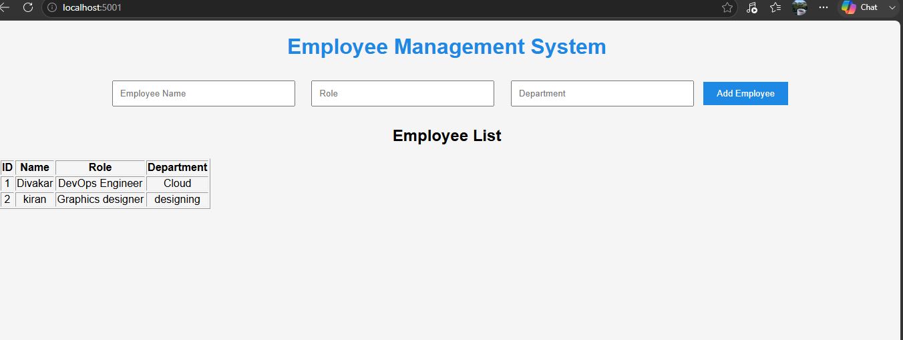
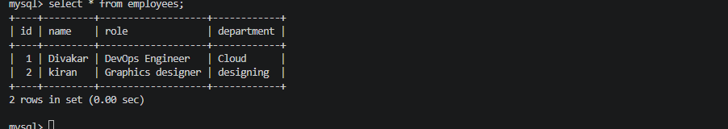
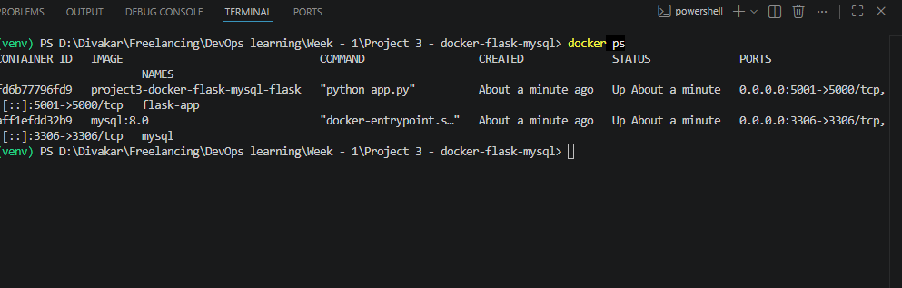

# 🚀 Employee Management System using Flask, MySQL & Docker Compose

A production-style DevOps project that demonstrates how to deploy a Python Flask application with a MySQL database using Docker Compose.

---

# 📌 Project Overview

This project is a simple Employee Management System where users can:

- ➕ Add Employees
- 📋 View Employee List
- 💾 Store Employee Data in MySQL
- 🐳 Run the complete application using Docker Compose

---

# 🏗 Project Architecture

                   +------------------+
                   |      Browser     |
                   +--------+---------+
                            |
                            |
                   HTTP :5000
                            |
                            v
                +-----------------------+
                |    Flask Container    |
                |-----------------------|
                | app.py                |
                | Flask                 |
                | PyMySQL               |
                +-----------+-----------+
                            |
                            |
                  Docker Bridge Network
                            |
                            |
                            v
                +-----------------------+
                |    MySQL Container    |
                |-----------------------|
                | employee_db           |
                | employees table       |
                | Volume                |
                +-----------------------+

---

# 🛠 Technologies Used

- Python 3.12
- Flask
- MySQL 8
- Docker
- Docker Compose
- HTML5
- CSS3
- Git
- GitHub

---

# 📂 Project Structure

```text
Project-3-Flask-MySQL
│
├── app.py
├── Dockerfile
├── docker-compose.yml
├── requirements.txt
├── .env
├── README.md
│
├── database
│     └── init.sql
│
├── templates
│     └── index.html
│
├── static
│     └── style.css
│
└── images
      ├── homepage.png
      ├── docker-build.png
      ├── employee-list.png
      ├── docker-run.png
      ├── docker-ps.png
```

---

# ⚙️ Prerequisites

- Docker Desktop
- Docker Compose
- Git
- VS Code (Recommended)

---

# 📥 Clone Repository

```bash
git clone https://github.com/divakar-cloud/docker-flask-mysql.git
```

```bash
cd docker-flask-mysql
```

---

# 🏗 Build Containers

```bash
docker compose build
```

---

# ▶ Start Application

```bash
docker compose up -d
```

---

# 🌐 Open Application

Open your browser and visit:

```
http://localhost:5001
```

---

# 📸 Homepage



---

# ➕ Add Employee

Enter:

- Employee Name
- Role
- Department

Click **Add Employee**

---

# 📋 Employee List

The employee details are stored in MySQL and displayed automatically.



---

# 🐳 Docker Compose

Start all containers

```bash
docker compose up -d
```

Stop containers

```bash
docker compose down
```

Restart

```bash
docker compose restart
```

---


# 🐳 Running Containers

```bash
docker ps
```

Expected:

- Flask Container
- MySQL Container



---

# 💾 Verify Database

Open MySQL container

```bash
docker exec -it mysql mysql -uroot -proot123
```

Use database

```sql
USE employee_db;
```

View employees

```sql
SELECT * FROM employees;
```

---

# 📦 Docker Commands

## Build

```bash
docker compose build
```

## Start

```bash
docker compose up -d
```

## Stop

```bash
docker compose down
```

## Restart

```bash
docker compose restart
```

## View Running Containers

```bash
docker ps
```

## View Logs

```bash
docker logs flask-app
```

## Enter Flask Container

```bash
docker exec -it flask-app bash
```

## Enter MySQL Container

```bash
docker exec -it mysql mysql -uroot -proot123
```

---

# 🗄 Database Schema

```sql
CREATE DATABASE employee_db;

CREATE TABLE employees
(
    id INT AUTO_INCREMENT PRIMARY KEY,
    name VARCHAR(100),
    role VARCHAR(100),
    department VARCHAR(100)
);
```

---

# 🧠 Concepts Learned

- Docker Images
- Docker Containers
- Docker Compose
- Docker Networking
- Docker Volumes
- Environment Variables
- Flask Application Development
- MySQL Integration
- SQL Queries
- CRUD Operations
- Git & GitHub

---

# 🎯 Interview Questions Covered

- What is Docker?
- What is Docker Compose?
- Difference between Docker and Docker Compose?
- What is a Docker Volume?
- What is a Docker Network?
- What is an Environment Variable?
- What is a Dockerfile?
- What is the purpose of EXPOSE?
- What is WORKDIR?
- Difference between Image and Container?
- How do containers communicate?
- How does Flask connect to MySQL?
- Why use Docker Compose?


---

# 🚀 Future Improvements

- Edit Employee
- Delete Employee
- Employee Search
- Login Authentication
- Pagination
- REST API
- Nginx Reverse Proxy
- Deploy to AWS EC2
- CI/CD using GitHub Actions
- Kubernetes Deployment

---

# 👨‍💻 Author

**Divakar P**

GitHub: https://github.com/divakar-cloud

---

# ⭐ Support

If you found this project useful, consider giving it a ⭐ on GitHub.
